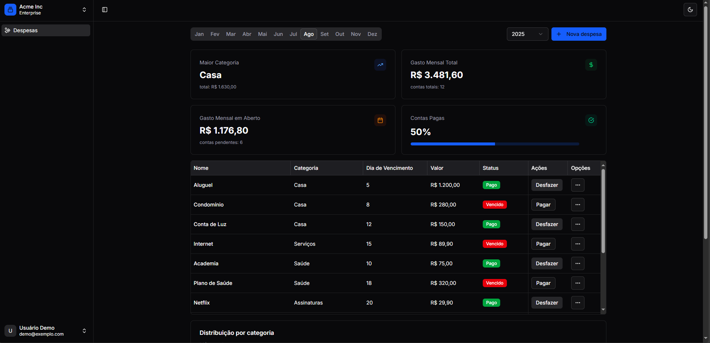
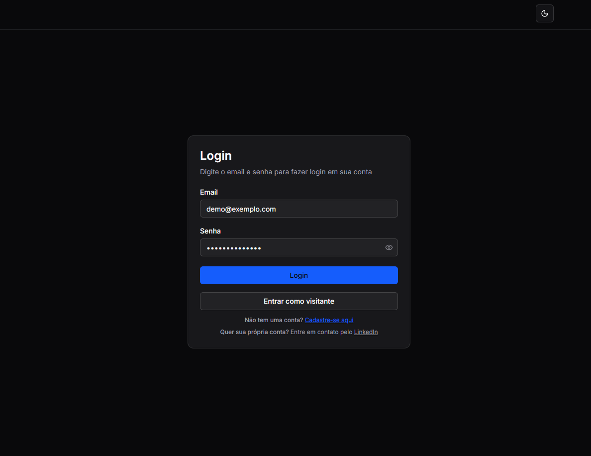

# 💸 UI Despesas - Frontend



Uma aplicação moderna e intuitiva para controle de despesas recorrentes, desenvolvida com Next.js 15 e React. Interface elegante e responsiva com componentes reutilizáveis e design system completo.

## 🚀 Tecnologias Utilizadas

### Core
- **Next.js 15** - Framework React com App Router
- **TypeScript** - Tipagem estática
- **React 18** - Biblioteca para interfaces
- **Tailwind CSS** - Framework CSS utilitário

### UI Components
- **Radix UI** - Componentes primitivos acessíveis
- **Lucide React** - Ícones modernos
- **shadcn/ui** - Sistema de componentes
- **next-themes** - Suporte a tema claro/escuro

### Formulários e Validação
- **React Hook Form** - Gerenciamento de formulários
- **Zod** - Validação de schemas

### Utilitários
- **Axios** - Cliente HTTP
- **js-cookie** - Gerenciamento de cookies
- **date-fns** - Manipulação de datas
- **class-variance-authority** - Variantes de classes CSS

## Pré-requisitos

- Node.js 18+ 
- pnpm (recomendado) ou npm
- API Backend rodando (veja o projeto `api-despesas`)

## ⚙️ Configuração

### 1. Clone o repositório e instale as dependências

```bash
# Clone o projeto (se ainda não fez)
git clone <url-do-repositorio>
cd despesas-recorrentes/ui-despesas

# Instale as dependências
pnpm install
# ou
npm install
```

### 2. Configure as variáveis de ambiente

Crie um arquivo `.env.local` na raiz do projeto `ui-despesas`:

```env
# URL da API Backend
NEXT_PUBLIC_API_URL=http://localhost:8000

# Credenciais do usuário demo (opcional)
NEXT_PUBLIC_DEMO_EMAIL=demo@exemplo.com
NEXT_PUBLIC_DEMO_PASSWORD=visitante@2025
```

### 3. Execute o projeto

```bash
# Desenvolvimento
pnpm dev
# ou
npm run dev

# Build para produção
pnpm build
# ou
npm run build

# Executar build de produção
pnpm start
# ou
npm start
```

A aplicação estará disponível em [http://localhost:3000](http://localhost:3000)

## 🏗️ Estrutura do Projeto

```
ui-despesas/
├── src/
│   ├── app/                    # App Router (Next.js 13+)
│   │   ├── auth/              # Páginas de autenticação
│   │   ├── private/           # Páginas protegidas
│   │   └── api/               # Backend for Frontend (BFF)
│   ├── components/            # Componentes React
│   │   ├── ui/               # Componentes base do shadcn/ui
│   │   └── customized/       # Componentes customizados
│   ├── hooks/                # Custom hooks
│   └── lib/                  # Utilitários e configurações
├── public/                   # Arquivos estáticos
│   └── images/              # Imagens do projeto
└── docs/                    # Documentação adicional
```

## 🔧 Scripts Disponíveis

```bash
# Desenvolvimento com Turbopack
pnpm dev

# Build para produção
pnpm build

# Executar versão de produção
pnpm start

# Linting
pnpm lint
```

## 🎨 Funcionalidades

### ✅ Implementadas
- [x] Sistema de autenticação (login/signup)
- [x] Dashboard principal
- [x] Gerenciamento de despesas recorrentes
- [x] Tema claro/escuro
- [x] Interface responsiva
- [x] Componentes reutilizáveis
- [x] Validação de formulários

## 🔐 Variáveis de Ambiente Obrigatórias

| Variável | Descrição | Exemplo |
|----------|-----------|---------|
| `NEXT_PUBLIC_API_URL` | URL da API backend | `http://localhost:8000` |
| `NEXT_PUBLIC_DEMO_EMAIL` | Email do usuário demo (opcional) | `demo@exemplo.com` |
| `NEXT_PUBLIC_DEMO_PASSWORD` | Senha do usuário demo (opcional) | `visitante@2025` |

## 🐳 Docker

O projeto também pode ser executado via Docker:

```bash
# Build da imagem
docker build -t ui-despesas .

# Executar container
docker run -p 3000:3000 \
  -e NEXT_PUBLIC_API_URL=http://localhost:8000 \
  ui-despesas
```

## 📱 Screenshots

### Tela Principal


### Tela de Login



## 👨‍💻 Autor

Paulo Henrique - [@Paulo-Henrique21](https://github.com/Paulo-Henrique21)

---

⭐ Dê uma estrela se este projeto te ajudou!
